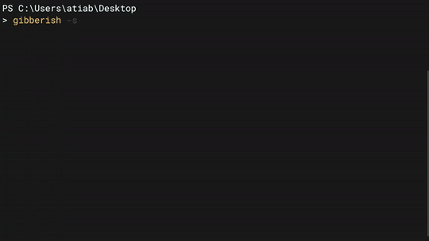

# gibberish

## Command-line "utility" to spit out gibberish.

Random characters from ASCII letters (upper and lower), digits, and punctuation characters.

> Binary in [Releases](https://github.com/atiabbz/gibberish/releases/) is compiled for Windows using `gcc.exe (MinGW-W64 x86_64-posix-seh, built by Brecht Sanders) 11.2.0` from [MinGW-W64 GCC-8.1.0](https://sourceforge.net/projects/mingw-w64/files/).

> **Pull requests for other platforms are welcome!**

## **Default (fast)**: `gibberish [--fast]`


## **Slow**: `gibberish --slow`



## **Usage**: `gibberish --help`

```text
Usage: gibberish [OPTION]
  -f, --fast  Prints strings of length in range [72, 99] before relinquishing control in each iteration.
  -s, --slow  Prints one character and relinquishes control in each iteration.
  -h, --help  Prints this help-text.
Print a stream of random characters from ASCII letters (upper and lower), digits, and punctuation characters.
```

_`gibberish.py` might actually be slightly more efficient from my anecdotal observations. Probably due to its heavy use of cool Python library functions and my subpar C skills._
